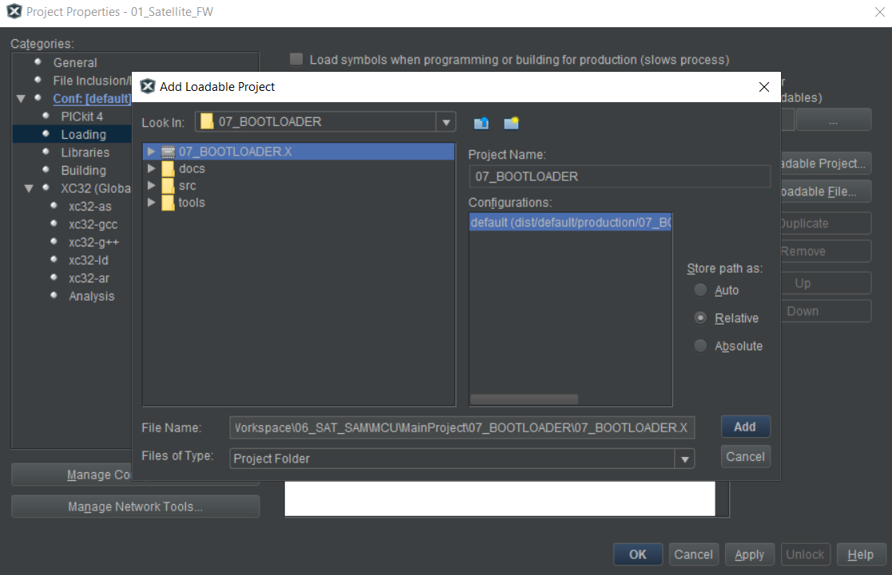
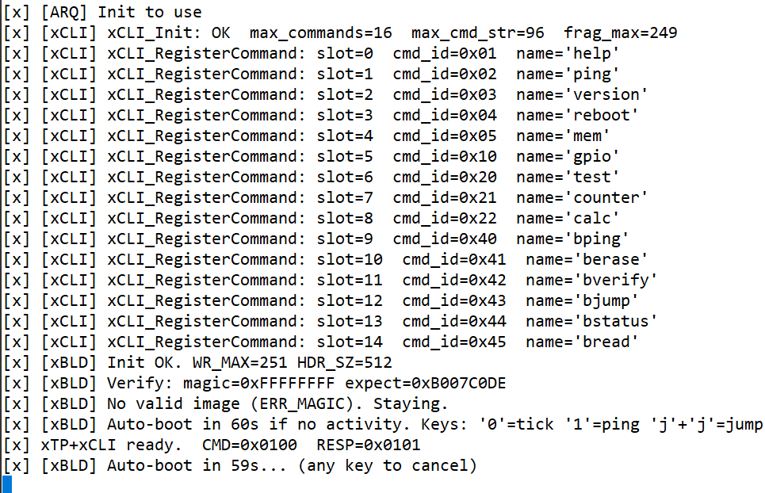
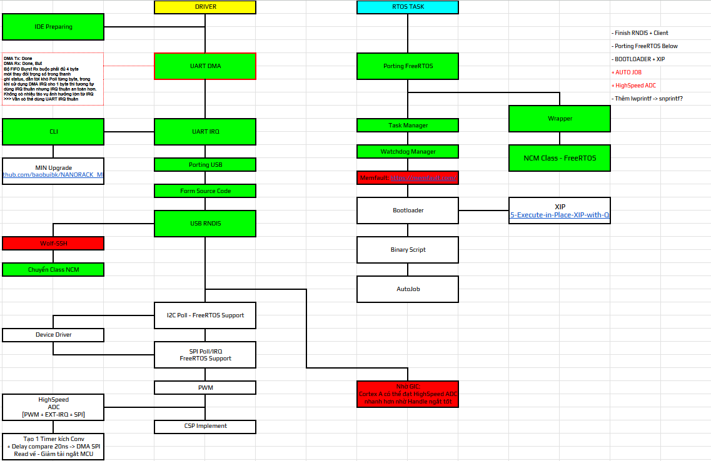

# SAM-EXP MCU Source
This is code for SAM-EXP-MCU/ATSAMV71-based boards

## Summary
- Target: ATSAMV71Q21B (SAMV71)
- OS: FreeRTOS
- Support: UART CLI, USB Network CLI, libcsp1.6, rgosh/rparam GOMSPACE, some library included
- Contents: boot manager, drivers, middleware, utilities and tests (see `src/`)

## How to test
### CLI
- Open UART console: 115200 8N1 and check boot logs
- Check USB enumeration and basic peripherals
- Run ncat to [192.168.6.8:2323] if board network is configured
### GS-Client
- `gs-client` interfaces with MCU Board via CSP-CAN
- On Linux board, run binary file to start script.

## Bootloader
#### Step 1: Run post-command to sign firmware HEX image

> **Example**:
```bash
python "../tools/xbld_sign.py" "${ImagePath}" "${ImageDir}/${ProjectName}_signed.hex"
```
#### Step 2: Add extra loadable projects
(Bootloader and Application will be flashed at the same time)

#### Step 3: Flash application using MPLAB
- Bootloader will run first
- Timeout: 60 seconds remaining for flashing via tool
- Press any key to reset

**If NOT using the flashing tool, press J twice (J + J) to force jump to the application**
  
  
## Upcoming

- Add more driver
- XIP/Bootloader
- Memory Optimization

## Changelog

### 07/01/2026
```
-> Sum: Release version for test
[Add] initial test release
```

### 26/02/2026
```
-> Sum: New features updated
[Add] CAN peripheral 1M Bitrate
[Add] libcsp1.6
[Fix] Some bug cli, xlog, dmesg
[Add] Compatible with GOMSPACE RPARAM/RGOSH 
[Add] .gitkeep for empty folder
```